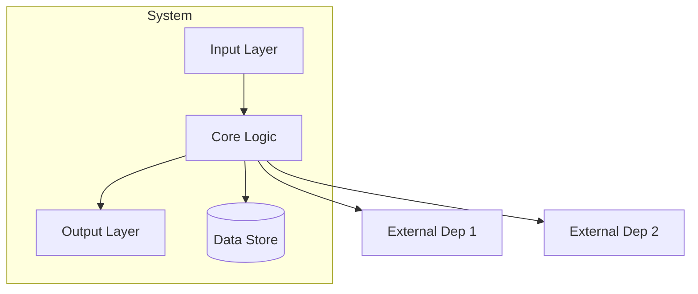

# Explain System

Build mental models of technical systems you can reason with. Not summaries. Understanding that lets you make product decisions, ask smart questions, and communicate accurately with engineers.

## Phase 1: Context Gathering

Before exploring, ask two questions and wait for answers:

1. **"What's driving your curiosity about this?"**
   - "Meeting about this tomorrow" vs "deep architecture understanding" produces very different outputs
   - This determines which sections to expand and which to keep brief

2. **"Are there other artifacts I should look at?"** (if only codebase provided)
   - Team documentation (Confluence, Notion, Google Docs, etc.), ticket tracker epics (Jira, Linear, GitHub Issues, etc.), architecture diagrams, READMEs, team-chat threads?

**If the user skips these questions** (e.g., "just explain it"): assume a general architecture overview at medium depth. Note this assumption in the outline proposal so the user can course-correct.

### Scope Negotiation

After initial exploration (Phase 2), if the target is large (3+ major subsystems, multiple services, or spans multiple repos), negotiate scope before continuing:

> "This system has [N] major subsystems: [list]. I can give you an overview of all of them, or go deep on one or two. What's most useful given [their stated motivation]?"

Never produce a 3000-token explanation when the user only needed one subsystem.

### Non-Code Targets

If the target is a concept, process, or documentation rather than a specific codebase:
- **Concept** ("how do we handle agent handoffs"): check team documentation, agent memory files, and the ticket tracker first. Skip the file exploration checklist. Map the concept through documentation and conversation.
- **Documentation URL or ticket epic**: use the relevant MCP tool for that platform (Atlassian, Notion, GitHub, etc.) or fall back to a web-fetch tool to retrieve the content, then apply the same analysis framework.
- **Multi-repo system**: identify all repos in Phase 1, explore one at a time, connect them in the Integration Map.

For non-code targets, adapt downstream phases: depth limits don't apply (there are no import chains), complexity assessment maps to breadth of documentation, and confidence signaling shifts from file:line references to source attribution ("per the design doc at <link>" / "based on the ticket description" / "inferred, not documented anywhere I found").

## Phase 2: Exploration

### Check Existing Knowledge First

Before exploring from scratch, check:
- Project memory files and the agent-instructions file (CLAUDE.md, AGENTS.md, GEMINI.md, or equivalent) for prior briefs
- Any prior exploration notes or briefs already captured for this system
- Earlier context in the current conversation

Only explore what you don't already know.

### Exploration Strategy

Use the Agent tool (subagent_type: Explore) for thorough codebase exploration. Prioritize in this order:

1. **Entry points first**: main, index, router, handler, app files
2. **Follow the request path**: trace a single request through the system end-to-end
3. **Map integration boundaries**: env vars, external imports, API clients, config files
4. **Read error handling only if integration complexity is high**

```
Exploration checklist:
[] Entry points (index, main, router, handler, app)
[] Trace one request path end-to-end
[] External dependencies (imports from outside the system, env vars, API clients)
[] Config and schema files
[] Error handling patterns (only if failure modes are relevant to user's goal)
```

### Depth Limits

- **Stop at 3 hops of import chains** from the entry point unless the user asked for more (barrel/index re-exports don't count as a hop)
- **Read no more than 8-10 files in full**. If you can't determine the architecture from 8-10 files, say so and ask the user which component to focus on
- **Note what you didn't explore** and why. Don't pretend you read everything

### Complexity Assessment

After exploration, internally classify:
- **Trivial** (single file or under ~200 lines): skip the outline proposal. Deliver a brief inline explanation covering purpose, inputs/outputs, and key decisions. Don't force the full Phase 3-6 workflow.
- **Simple** (single service, clear request path, few integrations): skip Integration Map, brief Failure Modes
- **Medium** (multiple components, some external deps): standard treatment
- **Complex** (distributed, many integrations, heavy error handling): expand Integration Map and Failure Modes, add Data Flow

## Phase 3: Verification & Adaptive Outline

### Self-Verification (Do Not Skip)

Before generating any explanation, re-read the 2-3 most critical files and confirm:
- Does your mental model match the actual control flow?
- Are there components you assumed a role for but didn't verify?
- If uncertain about any component's role, **flag it explicitly** rather than guessing

> Example: "I'm fairly confident the routing layer delegates to handlers based on the path matcher in `router.ts:42`, but I didn't find where fallback routing is configured. Worth confirming with the team."

### Propose an Adaptive Outline

Based on what you found, propose a custom outline. Draw from the Section Library below, but **do not use all sections for every system**. Select what matters for this system and this user's goal.

```markdown
## Proposed Outline

Based on what I found, here's what I'd cover:

1. The Analogy
2. Architecture Overview (Mermaid diagram)
3. [Section selected based on complexity]
4. [Section selected based on user's goal]
5. Questions to Ask the Team

Want me to adjust this before I dive in?
```

Wait for confirmation or adjustment before proceeding.

## Phase 4: Explanation

Deliver the sections from the approved outline. For outlines with 4+ sections, offer one natural pause at a logical midpoint (e.g., after architecture + data flow, before failure modes + questions). Don't pause after every section since the user already approved the outline.

### Confidence Signaling

Throughout the explanation, distinguish between:
- **Verified**: "Based on `handler.ts:15`, requests route through..."
- **Inferred**: "Based on the import pattern, this likely..."
- **Uncertain**: "I didn't find explicit configuration for this. Worth asking the team."

Never present everything with equal confidence. A PM who takes uncertain information into a meeting as fact will get burned.

---

## Section Library

These are the available sections. Use the ones that fit, skip the rest.

### The Analogy

One paragraph. Anchor the system to something familiar.

> "Think of [system] like [familiar thing]. It [core function explained simply]. Just as [analogy extension], this system [key behavior]."

Good analogies are specific: "airport control tower" (routing), "librarian's desk" (caching), "triage nurse" (prioritization). Bad analogies are vague: "like a pipeline" (everything is a pipeline).

### Architecture Overview

**Mermaid diagram** (renders natively in most wikis, GitHub, GitLab, Notion):



Label components with their actual names from the codebase. Show boundaries. Indicate data flow direction.

ASCII diagrams only if the user specifically requests terminal-native output.

### Integration Map

**Use when**: System has 2+ external dependencies or the user cares about failure impact.

**Depends On (Upstream):**
| System | What It Provides | If It Fails |
|--------|------------------|-------------|
| Auth Service | User identity | Requests rejected (401) |

**Feeds Into (Downstream):**
| System | What It Receives | If It Fails |
|--------|------------------|-------------|
| Analytics | Event stream | Metrics delayed, not lost |

### Data Flow

**Use when**: The request path is non-obvious or has critical decision points.

Step-by-step narrative:

```
1. Request arrives at [entry point]
2. [Component A] validates [what]
3. [Component B] decides [what] based on [criteria]  <-- critical decision point
4. [Component C] executes [action]
5. Response returns via [path]
```

Highlight where bugs, misunderstandings, or performance issues tend to concentrate.

### Failure Modes & Edge Cases

**Use when**: System has complex error handling, or user needs to understand operational risk.

| Scenario | What Happens | How It's Handled | User Impact |
|----------|--------------|------------------|-------------|
| Database timeout | Query fails | Retry 3x, then error | Customer sees error page |
| Upstream service down | No auth | Circuit breaker, cached tokens | Degraded experience for ~5min |

**User Impact calibration:**
- **Transparent**: User never notices (automatic retry, failover works)
- **Degraded**: Partial functionality, slower response, or fallback experience
- **Visible**: User sees an error, gets blocked, or needs to retry
- **Escalation-worthy**: Affects enough users or revenue to require stakeholder communication

### Key Terminology

**Use when**: System uses heavy domain jargon (e.g., "saga", "circuit breaker", "hydration") that will come up in meetings.

| Term | Plain Definition | Why It Matters |
|------|------------------|----------------|
| `Term` | What it is in simple language | Why a PM should care |

Keep to 5-10 terms. Only include terms the user will encounter in conversation, not implementation details. If the system has few domain-specific terms, skip this section and define terms inline where they first appear.

### Configuration & Environment

**Use when**: System behavior varies significantly based on configuration (feature flags, environment-specific routing, env vars that change behavior).

| Config | What It Controls | Where It Lives |
|--------|------------------|----------------|
| `API_TIMEOUT` | Max wait for upstream calls | `.env` / Kubernetes config |
| `ENABLE_CACHE` | Toggle caching layer | Feature flag service |

Skip this section for systems with minimal or standard configuration.

### Questions to Ask the Team

Concrete questions tailored to what the exploration revealed. Group by category:

**Architecture**: "What's the p99 latency for [critical path]?"
**Operations**: "What alerts fire when [failure mode] happens?"
**Future**: "What are the known limitations we're working around?"

---

## Phase 5: Comprehension Check

After delivering the explanation, proactively offer one scenario question (this is a single quick check, not a quiz. For extended testing, the user can request Phase 7):

> "Quick check to make sure my explanation landed: if [specific failure condition from this system], what would happen to [user-facing behavior]?"

This serves two purposes:
1. Catches gaps in the user's understanding
2. Catches errors in your explanation (if the user's answer reveals your explanation was wrong, correct it)

If the user engages, follow up with gap identification:
> "You've got [X] solid. The gap I'd focus on is [Y] because [why it matters for their role]."

## Phase 6: Exportable Artifacts

Provide copy-paste ready exports at the end:

```markdown
## Exportable Artifacts

### Mermaid Diagram (paste into your wiki, GitHub README, Notion page, etc.)
[Full mermaid code block]

### Questions Checklist
- [ ] Question 1
- [ ] Question 2
```

## Phase 7: Active Learning (On Request)

Only if the user asks: "quiz me", "test my understanding", or "let's do active learning."

**Teach-Back**: "In one sentence, explain what happens when [scenario]."
**Scenario**: "If [failure condition], what would happen to [user-facing behavior]?"
**Connection**: "How does this relate to [system they know]?"
**Gap ID**: "You've got [X] solid. Focus on [Y] because [reason]."

---

## Output Quality Standards

**Do:**
- Reference specific files and line numbers in `filename.ext:lineN` format (e.g., `handler.ts:15`). Always include the filename, even for single-file systems
- Tailor depth to the user's stated motivation
- Signal confidence level on every claim
- Define domain terms inline, on first use, in the section where they matter
- Keep analogies specific and grounded

**Don't:**
- Generic explanations that could describe any system
- Equal confidence on verified facts and inferences
- Jargon without inline definition
- Diagrams that don't match the code you actually read
- Sections that add nothing for this particular system
