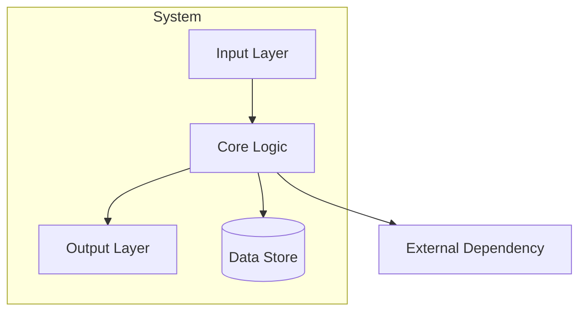

# Section library

Use only the sections approved in the adaptive outline. Replace placeholders with names and evidence from the inspected system.

## Analogy

Write one paragraph anchored to a specific familiar system, such as an airport control tower for routing, a librarian's desk for caching, or a triage nurse for prioritization. Explain both the useful correspondence and where the analogy stops. A generic “pipeline” comparison is too broad to carry a mental model.

## Architecture Overview

Use a Mermaid diagram with actual component names, visible system boundaries, and directed data flow:



Every node must correspond to source you inspected. Use ASCII only when the user requests terminal-native output.

## Integration Map

Show both sides of the boundary when they exist:

**Depends On (Upstream):**

| System | What It Provides | If It Fails |
| --- | --- | --- |
| Auth Service | User identity | Requests rejected (401) |

**Feeds Into (Downstream):**

| System | What It Receives | If It Fails |
| --- | --- | --- |
| Analytics | Event stream | Metrics delayed, not lost |

## Data Flow

Trace one real path in execution order:

```text
1. Request arrives at [entry point]
2. [Component A] validates [what]
3. [Component B] decides [what] based on [criteria]  <-- critical decision point
4. [Component C] executes [action]
5. Response returns via [path]
```

Highlight decision points where bugs, misunderstandings, or performance problems concentrate.

## Failure Modes & Edge Cases

| Scenario | What Happens | How It's Handled | User Impact |
| --- | --- | --- | --- |
| Database timeout | Query fails | Retry 3x, then error | Customer sees error page |
| Upstream service down | No auth | Circuit breaker, cached tokens | Degraded experience for ~5 min |

Calibrate user impact as:

- **Transparent**: automatic handling prevents user-visible impact
- **Degraded**: partial functionality, slower response, or fallback experience
- **Visible**: the user sees an error, is blocked, or must retry
- **Escalation-worthy**: impact warrants stakeholder communication

## Key Terminology

Include 5-10 terms the user will encounter in discussion:

| Term | Plain Definition | Why It Matters |
| --- | --- | --- |
| `Term` | Meaning in plain language | Consequence for the user's role |

Define implementation-only terms inline instead of expanding this table.

## Configuration & Environment

| Config | What It Controls | Where It Lives |
| --- | --- | --- |
| `API_TIMEOUT` | Maximum wait for upstream calls | `.env` or deployment config |
| `ENABLE_CACHE` | Caching behavior | Feature flag service |

Include only settings that materially change the system's behavior.

## Questions to Ask the Team

Ground every question in a source gap or operational decision uncovered during exploration. Group them by the smallest useful set of categories, such as Architecture, Operations, and Future Direction.
